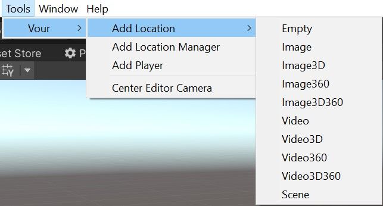
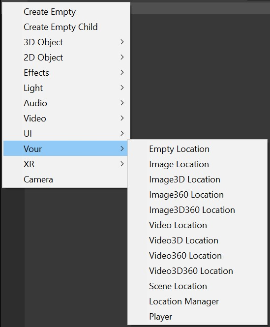
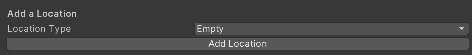

Ways of Adding Locations
========================

 There are 3 ways:
 1. Via Tools in the menu bar  
   
  
 2. Via Create ("+" icon) in Inspector / GameObject in menu bar  
   
  
 3. Via Location Manager  
 