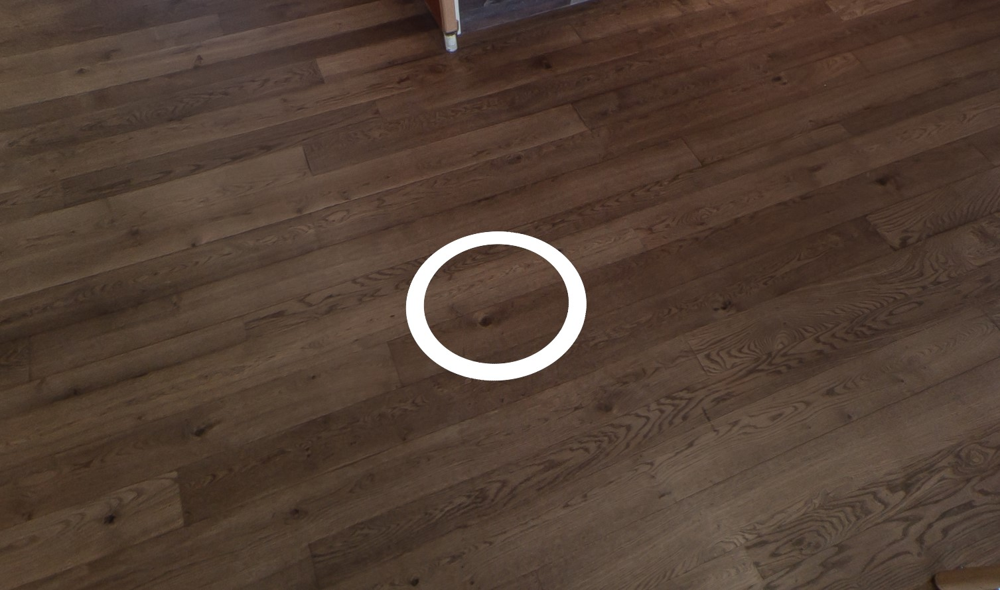
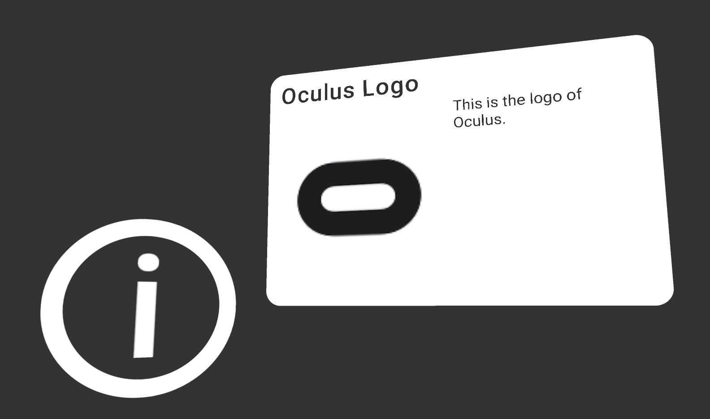

Structure of Vour
=================

### 1. Location Manager
 The Location Manager manages which locations should be activated and which location is activated first.
 Since it contains all meshes & components to visualize the images/videos, it also manages the activation of these meshes & components.

### 2. Player
 The Player prefab automatically instantiates the PC / VR player. When the *Center Camera* option is enabled, the camera will always stay at (0, 0, 0). If you want to just have the PC player or just the VR player, get the prefab at **Assets** > **Vour** > **Prefabs** > **Players** and replace the Player prefab with it.
 > [!NOTE]
 > The Player prefab has to be placed on the ground if you have *Center Camera* disabled because it has a 1.7m Y-offset when in PC mode (which you can edit in the prefab), and floor tracking is enabled in VR.

### 3. Locations
 Locations contain data of your video/image and other stuff like Teleport Points, Info Points or custom objects. For more info, look [here](locations/location_types.md).
 
### 4. Teleport Points
 Teleport Points are placed in a Location in 3D space. For example, you can place it so that it looks like it is on the ground in a 360° location. You can add a Teleport Point by clicking on the button in the Location object.  
 
 
### 5. Info Points
 Info Points can display a short text and a image on the left or right side. You can add a Info Point by clicking on the button in the Location object.  
 